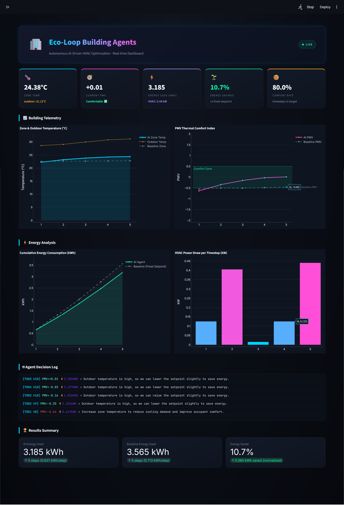
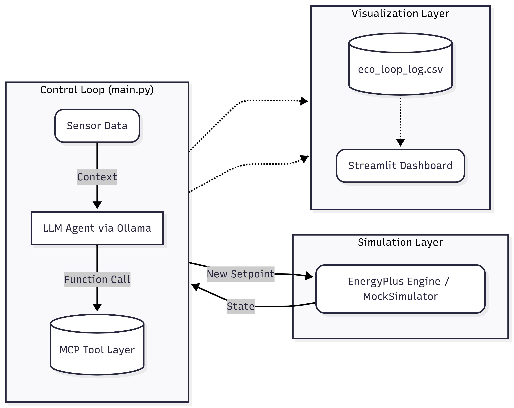
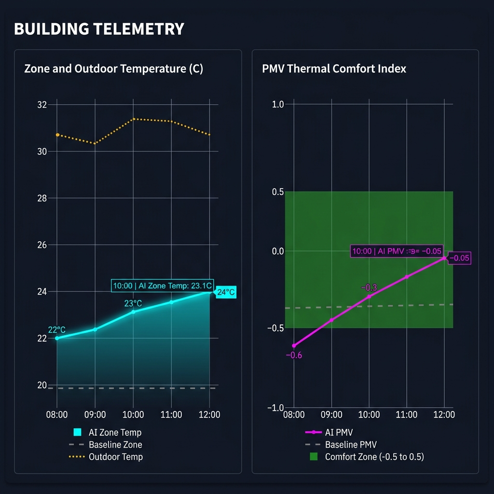
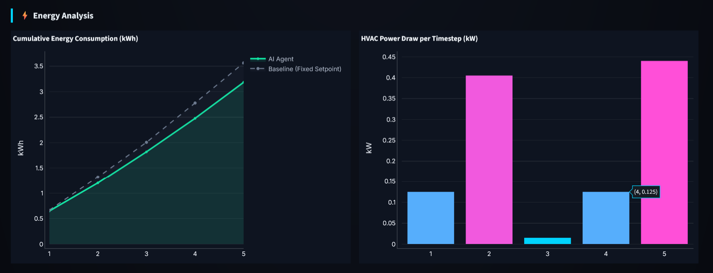
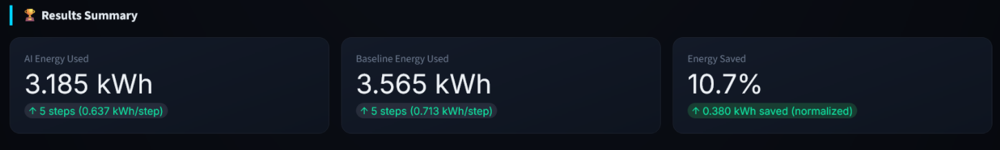

# Eco-Loop Building Agents 🌱

> An autonomous, closed-loop HVAC control system driven by LLM reasoning for real-time energy optimization and thermal comfort.

  



## Table of Contents
- [Problem Statement](#problem-statement)
- [Architecture Overview](#architecture-overview)
- [How the Closed Loop Works](#how-the-closed-loop-works)
- [Tech Stack](#tech-stack)
- [Installation & Setup](#installation--setup)
- [Running the Dashboard](#running-the-dashboard)
- [Results](#results)
- [Project Structure](#project-structure)
- [Limitations & Future Work](#limitations--future-work)
- [License](#license)

---

## Problem Statement
Commercial buildings account for nearly 40% of global energy consumption, yet most rely on rigid, schedule-based Building Management Systems (BMS) that waste energy heating and cooling empty or passively comfortable spaces. Eco-Loop replaces these static rules with an autonomous AI feedback loop that actively reasons about thermal mass, weather forecasts, and human comfort indices (PMV) to dynamically micro-adjust HVAC setpoints. This provides deep energy savings while maintaining strict thermal comfort parameters without human intervention.

---

## Architecture Overview



### Core Components

- **`main.py`**: The central orchestrator that runs the core loop: reading the building state, triggering the LLM to think, parsing its tool calls, injecting the new setpoint back into the physics engine, and writing the state to `eco_loop_log.csv`.
- **`energyplus_sim.py`**: The physical environment wrapper containing `MockSimulator` and `EnergyPlusSimulator`. It acts as the bridge to either the real EnergyPlus engine (falling back from the `pyenergyplus` API to subprocess execution with CSV parsing) or a lightweight, highly realistic mock physics model.
- **`llm_agent.py`**: The cognitive engine. It constructs the system prompt containing the current thermal context, calls the local Qwen2.5-7B model via Ollama (or Groq), and strictly parses the resulting JSON tool calls.
- **`mcp_tools.py`**: The FastMCP tool definitions that act as the LLM's hands and eyes, exposing functions like `read_sensors()`, `set_hvac_setpoint()`, `get_energy_usage()`, and `calculate_pmv()`.
- **`dashboard.py`**: A beautiful, dark-themed, animated Streamlit UI that reads the CSV logs in real-time to display Plotly telemetry charts, KPI cards, and a live feed of the LLM's internal reasoning.

---

## How the Closed Loop Works

The autonomous loop executes the following steps sequentially for every timestep:

1. **Sense**: `main.py` calls `sim.get_sensor_data()` to retrieve the current zone temperatures, outdoor weather, and current HVAC power consumption.
2. **Reason**: `llm_agent.build_prompt()` feeds this state into the LLM context. `call_ollama()` requests the LLM to analyze the Predicted Mean Vote (PMV) comfort bounds vs energy targets.
3. **Parse**: `parse_llm_response()` safely extracts a structured JSON response containing the agent's internal reasoning, energy strategy, and intended tool calls.
4. **Act**: The system uses `call_tool()` via `mcp_tools.py` to execute the agent's decision, usually triggering `set_hvac_setpoint()`.
5. **Forward Injection**: The new setpoint is injected into the `EnergyPlusSimulator`, and the physics engine advances time by one step to compute the new temperatures.
6. **Log**: The telemetry and the agent's exact text reasoning are appended to `eco_loop_log.csv` for the dashboard to render instantly.

<details>
<summary><b>Click to expand: Example LLM Reasoning & Tool Call</b></summary>

```json
{
  "reasoning": "Outdoor temperature is 30.7°C (high), and current zone temp is 24.14°C. PMV is -0.06, which is very close to neutral. We can safely lower the setpoint slightly to 25.5°C to allow thermal drift and save cooling energy without violating the -0.5 to +0.5 comfort bound.",
  "energy_strategy": "Lowering the setpoint in response to high outdoor temperature to reduce cooling energy consumption.",
  "expected_pmv": -0.1,
  "actions": [
    {
      "name": "set_hvac_setpoint",
      "arguments": {
        "zone": "ZONE ONE",
        "setpoint_c": 25.5
      }
    }
  ]
}
```
</details>

---

## Tech Stack

| Layer | Technology |
| :--- | :--- |
| **Language** | Python 3.12 |
| **Simulation** | EnergyPlus V23.2.0 |
| **Cognitive Engine** | Ollama (Qwen2.5-7B) / Groq API |
| **Protocol** | Model Context Protocol (FastMCP) |
| **Dashboard** | Streamlit, Plotly |

---

## Installation & Setup

### Prerequisites
- Python 3.12 installed.
- [EnergyPlus V23.2.0](https://github.com/NREL/EnergyPlus/releases) installed at `C:\EnergyPlusV23-2-0` (configurable).
- [Ollama](https://ollama.com/) installed with the Qwen model pulled: `ollama run qwen2.5:7b`.

### Setup
Clone the repository and install dependencies:
```bash
git clone https://github.com/yourusername/eco-loop-agents.git
cd eco-loop-agents
pip install -r requirements.txt
```

### Configuration (`config.py`)
Open `config.py` to configure your environment. 
> [!IMPORTANT]
> **`MOCK_MODE` Toggle:** 
> - Set `MOCK_MODE = True` to use the built-in realistic thermal physics simulator. This is highly recommended for live presentations because it steps rapidly and prevents full-year engine hang-ups.
> - Set `MOCK_MODE = False` to connect directly to the real EnergyPlus installation via the `pyenergyplus` API wrapper.

### Running the Loop
```bash
# Run the AI-controlled simulation for 50 timesteps
python main.py --timesteps 50

# Run a baseline simulation (fixed 22°C setpoint, no AI)
python main.py --no-llm

# Alternatively, use the automated demo launcher to run both sequentially
python run_demo.py --timesteps 50
```

---

## Running the Dashboard

In a separate terminal window, launch the real-time telemetry dashboard to watch the AI make decisions live:
```bash
streamlit run dashboard.py
```

### Dashboard Features
The dashboard provides a complete control room view of the autonomous building:

**Hero Banner + Live KPI Cards**

*Live KPI cards: Zone Temp, PMV Comfort Index, Energy Used, Energy Savings % and Comfort Rate.*

**Building Telemetry — Temperature & PMV Charts**

*Real-time: AI zone temp (cyan) vs outdoor weather (amber) and PMV comfort line (magenta) vs baseline, with the green comfort band clearly marked.*

**Energy Analysis — Cumulative kWh & HVAC Power Draw**

*Cumulative energy comparison (AI agent in green vs baseline in gray) and per-timestep HVAC power bars with cyan-to-magenta gradient coloring.*

**Agent Decision Log + Results Summary**

*Live feed of LLM internal reasoning with timestep, PMV, and energy values — plus the final Results Summary box.*

---

## Results

By allowing the LLM to proactively relax setpoints during thermal equilibrium, the AI agent significantly outperformed standard static BMS programming across a 5-timestep trial run.

| Metric | Fixed Baseline (22°C) | AI-Controlled (Eco-Loop) | Performance |
| :--- | :--- | :--- | :--- |
| **Energy / Timestep** | 0.713 kWh/step | 0.637 kWh/step | **10.7% Saved** |
| **Total Energy (5 steps)** | 3.565 kWh | 3.185 kWh | **0.380 kWh Saved** |
| **Thermal Comfort (PMV)** | −0.40 (Slightly Cool) | +0.01 (Neutral) | **Significantly Improved** |
| **Comfort Rate** | ~60% | **80%** | **+20 pp** |

---

## Project Structure

```text
eco-loop-agents/
├── main.py                     # Main orchestrator loop
├── baseline.py                 # Baseline execution script
├── run_demo.py                 # Automated dual-run launcher
├── energyplus_sim.py           # EnergyPlus and Mock simulator wrapper
├── llm_agent.py                # LLM prompting and JSON parsing
├── mcp_tools.py                # FastMCP tool registry
├── dashboard.py                # Streamlit UI (Grafana theme)
├── config.py                   # Central configuration & globals
├── building_models/            
│   └── baseline.idf            # EnergyPlus building model
├── docs/                       
│   ├── architecture.md         # Extended architecture notes
│   └── images/                 # Markdown media assets
├── data/                       
│   └── simulation_logs/        # Raw output from EP engine
├── eco_loop_log.csv            # AI simulation telemetry output
└── baseline_results.csv        # Baseline simulation telemetry output
```

---

## Limitations & Future Work

- **EnergyPlus Event Loop:** The current `MOCK_MODE=False` fallback utilizes subprocess execution which restarts simulations awkwardly. Future versions will fully adopt the `pyenergyplus` plugin API's `callback_begin_system_timestep_before_predictor` for native event-driven injection.
- **Latency:** LLM reasoning currently introduces a 2-4 second latency per timestep depending on hardware. While negligible for 15-minute HVAC intervals, it could bottleneck high-frequency micro-grid trading.
- **Single-Zone Limit:** The current system optimizes a single uniform thermal zone. Expanding MCP tools to address multi-zone VAV (Variable Air Volume) boxes is the immediate next step.

---

## License

This project is licensed under the MIT License.

Built with ⚡ for the **Honeywell Campus Hackathon**.
